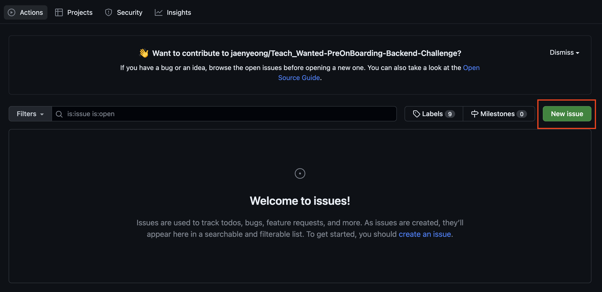
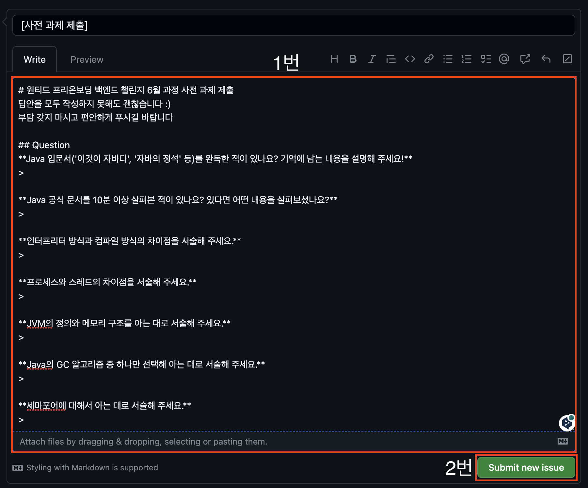

# 원티드 프리온보딩 백엔드 챌린지 6월
Java 교육 과정입니다.
- 커리큘럼은 추후 추가 예정

## 사전 과제 제출하는 법

### (1) `Issues` 버튼을 눌러 이슈 페이지로 이동

### (2) `New issue` 버튼을 눌러 이슈 생성 페이지로 이동

### (3) 과제 제출용 템플릿에 있는 `Get started` 버튼을 눌러 이슈 작성 페이지로 이동

### (4) 1번 질문 영역에 답안 작성 후 2번 `Submit new issue` 버튼을 눌러 과제 제출
