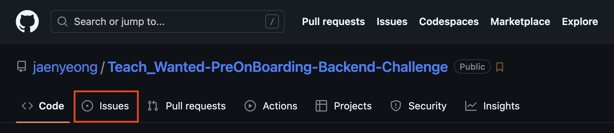
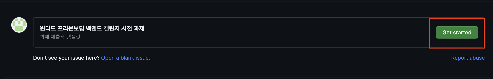

# 원티드 프리온보딩 백엔드 챌린지 6월
원티드 플랫폼에서 진행되는 2023년 06월 교육 과정입니다.  
[Java 꽉 잡아! : JVM부터 GC, 스레드 동기화까지!](https://www.wanted.co.kr/events/pre_challenge_be_8)
* 단순히 Java의 문법만 사용하는 것이 아닌 Java에 대해 더 깊게 알아보고, 이를 통해 무지성 코딩을 지양하고 한 번 더 생각하는 습관을 들여봅니다!
* 클래스 로딩 과정, 바이트코드, JIT 컴파일러 등을 이해하며 자바가 동작하는 방식에 대해 알아봅니다.
* JVM 메모리 구조와 GC, 스레드 동기화 등 Java 프로그래밍에 필요한 개념들에 대해 알아봅니다.

---

## 커리큘럼

### 1-1 Java의 정의와 동작 방식에 대해 살펴봅니다.
[ 키워드 ] Java, JRE, JDK, JVM, AOT, JIT, Java Bytecode, Code Cache, ByteBuddy
* Java의 구성 요소와 동작 방식
* 클래스 로더와 클래스 로딩
* Java 바이트코드와 코드 캐시
* 바이트코드를 컴파일하는 AOT, JIT 컴파일러
* [ 아하! 모먼트 ] '내가' 수행 업무와 성과를 따로 기록하는 이유는?

### 1-2 JVM의 정의와 구조, 메모리에 대해 살펴봅니다.
[ 키워드 ] JVM, JMM(Java Memory Model), Memory Leak, Thread dump, Heap dump
* JVM과 메모리 구조
* Java 메모리 모델과 메모리 누수
* 스레드덤프를 통한 스레드의 상태 정보 확인
* 힙덤프를 통한 힙 메모리 확인
* [ 아하! 모먼트 ] '내가' 채용 공고를 볼 때 중요하게 보는 항목은?

### 1-3 GC(Garbage Collection)의 정의와 Java GC 알고리즘에 대해 살펴봅니다.
[ 키워드 ] SerialGC, Parallel GC, CMS GC, G1 GC, Shenandoah GC, ZGC, Epsilon GC
* 가비지 컬렉션의 정의와 가비지 컬렉터가 처리하는 Heap 영역
* Heap 영역을 제외한 GC 처리 영역
* Java에서 지원하는 GC 알고리즘
* [ 아하! 모먼트 ] '내가' 생각하는 스터디의 핵심 요소와 선호하는 진행 방식은?

### 1-4 동시성 처리를 위한 스레드 동기화에 대해 살펴봅니다.
[ 키워드 ] Thread Synchronization, Semaphore, Mutex, volatile, synchronized, CAS, java.util.concurrent package, Virtual Thread
* 스레드 동기화와 동시성
* 멀티 스레드 환경에서 발생하는 스레드 동기화 문제
* Java에서 스레드 동기화를 위해 제공하는 기능
* JDK 19에 추가된 가상 스레드
* [ 아하! 모먼트 ] '내가' 코드 리뷰 문화 도입과 개선을 위해 시도한 방법

---

## 사전 과제 제출하는 법

### (1) `Issues` 버튼을 눌러 이슈 페이지로 이동

### (2) `New issue` 버튼을 눌러 이슈 생성 페이지로 이동

### (3) 과제 제출용 템플릿에 있는 `Get started` 버튼을 눌러 이슈 작성 페이지로 이동

### (4) 1번 질문 영역에 답안 작성 후 2번 `Submit new issue` 버튼을 눌러 과제 제출

---

## 사전 과제
* Java 입문서('이것이 자바다', '자바의 정석' 등)를 완독한 적이 있나요? 기억에 남는 내용을 설명해 주세요!
* Java 공식 문서를 10분 이상 살펴본 적이 있나요? 있다면 어떤 내용을 살펴보셨나요?
* 인터프리터 방식과 컴파일 방식의 차이점을 서술해 주세요.
* 프로세스와 스레드의 차이점을 서술해 주세요.
* JVM의 정의와 메모리 구조를 아는 대로 서술해 주세요.
* Java의 GC 알고리즘 중 하나만 선택해 아는 대로 서술해 주세요.
* 세마포어에 대해서 아는 대로 서술해 주세요.
* Java의 `synchronized`에 대해서 아는 대로 서술해 주세요.
* 강의 커리큘럼과 관련하여 기대하는 내용이나 다뤘으면 하는 내용이 있나요?
* 회사 생활 또는 개발자로서 궁금한 질문이나 고민이 있나요?
* 이외에 추가로 바라는 점이나 하고 싶은 말씀을 남겨주세요!
